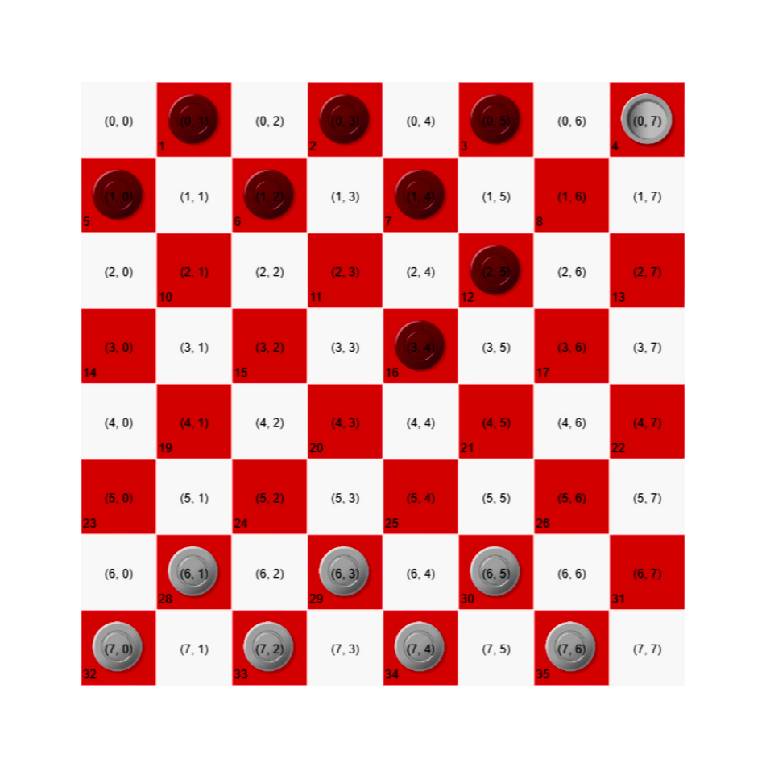

# คำอธิบาย

## การเดินเบี้ยแนวทแยง

1. ค่าพิกัดความต่างทั้ง x, y ต้องเท่ากับ 1 

## การกินตัวเบี้ย

1. หาจุดกึ่งกลางระหว่างจุด (x, y) ใด ๆ แล้วหารด้วย 2 
2. และนำค่าดังกล่าวออกจาก array 2d

## การกินเบี้ยขุน
1. ค้นหาเบี้ยทั้งแนวทแยงใด ๆ มีเลขฝ่ายตรงข้ามเท่ากับ 1
2. นำค่าพิกัดดังกล่าวออกจาก array 2d

---

